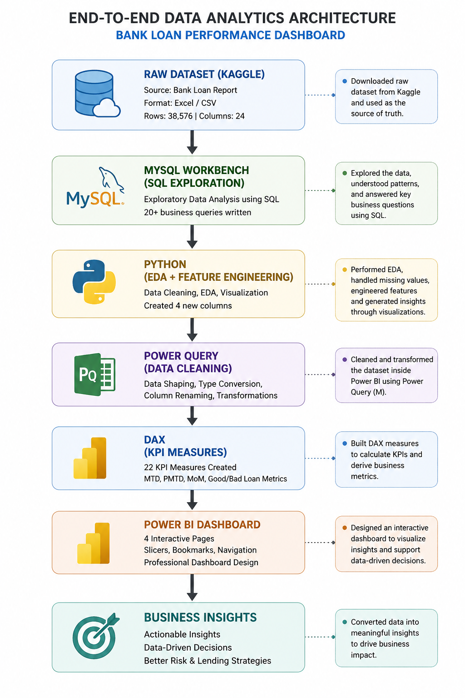
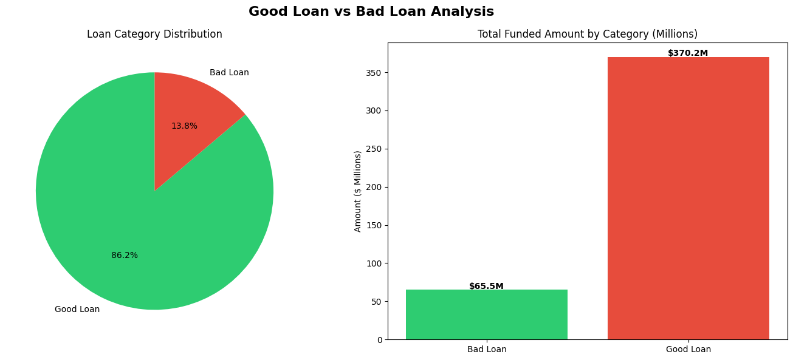
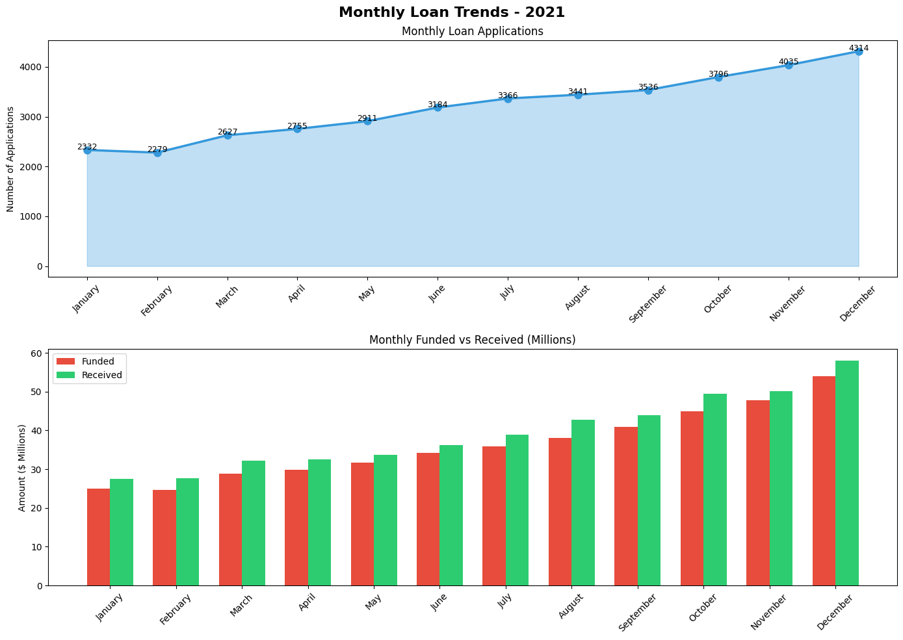
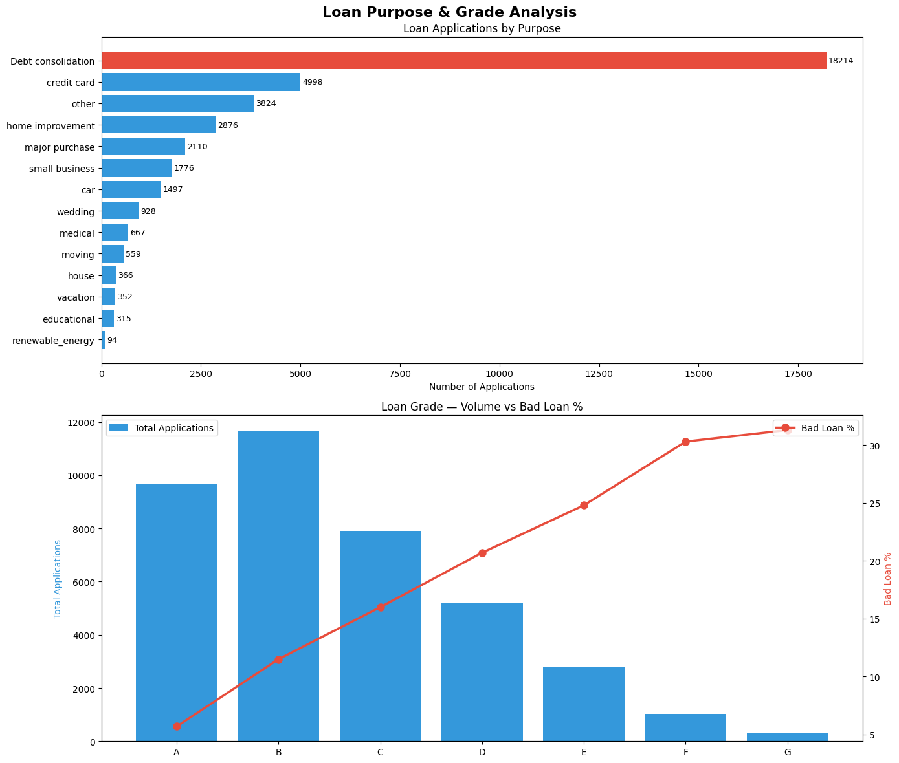
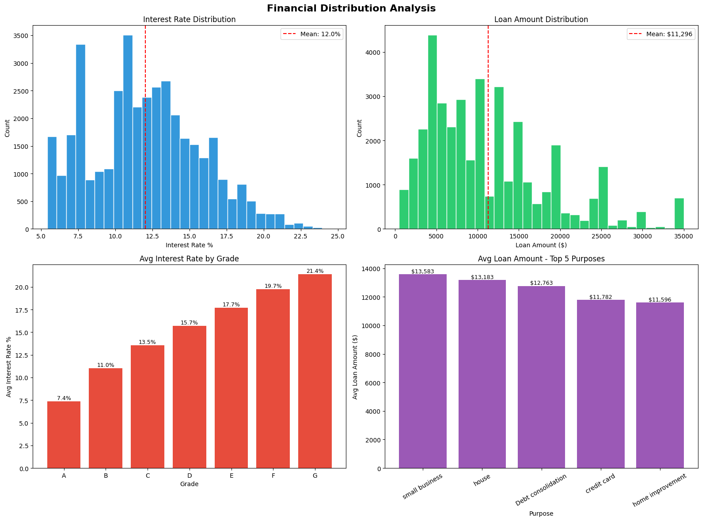
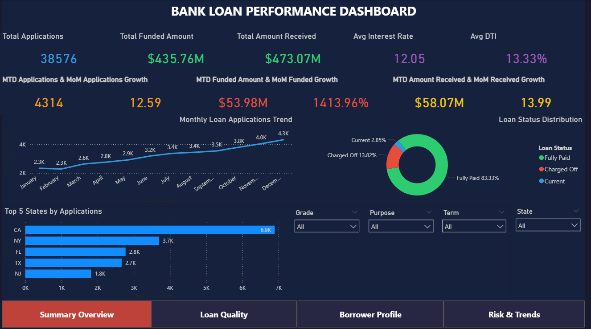
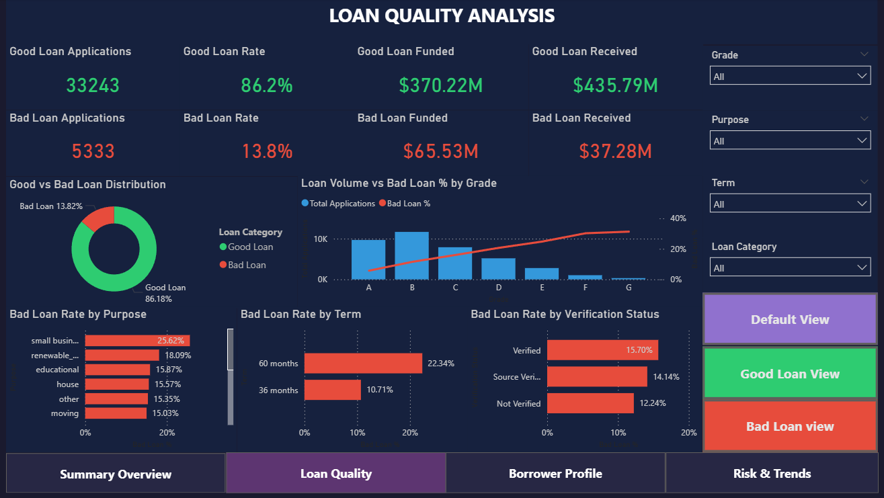
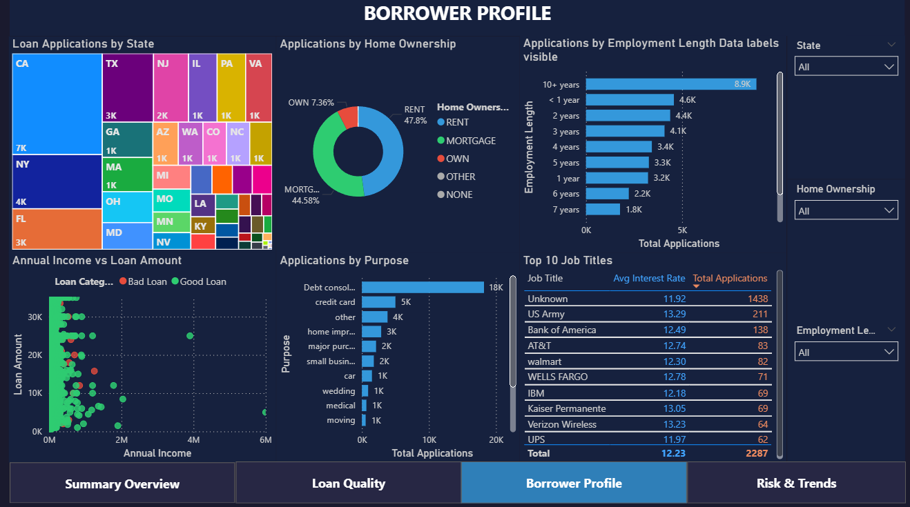
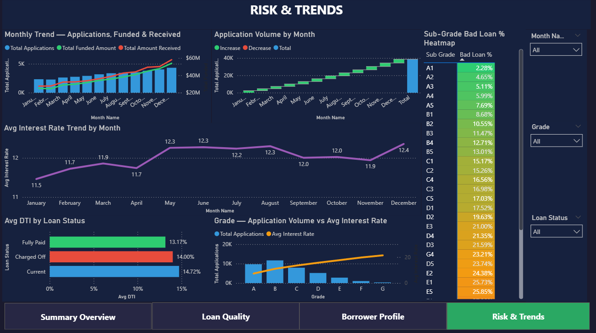

# 📋 Project Report — Bank Loan Performance Dashboard

> A complete end-to-end Data Analytics project report documenting the full
> workflow, technical decisions, challenges encountered, and outcomes achieved.

---

## 📋 Table of Contents

1. [Project Overview](#1-project-overview)
2. [Dataset Description](#2-dataset-description)
3. [Project Architecture](#3-project-architecture)
4. [Step 1 — Data Acquisition & Setup](#4-step-1--data-acquisition--setup)
5. [Step 2 — SQL Exploration](#5-step-2--sql-exploration)
6. [Step 3 — Python EDA](#6-step-3--python-eda)
7. [Step 4 — Power Query M Transformations](#7-step-4--power-query-m-transformations)
8. [Step 5 — DAX Measures](#8-step-5--dax-measures)
9. [Step 6 — Power BI Dashboard](#9-step-6--power-bi-dashboard)
10. [Challenges & Solutions](#10-challenges--solutions)
11. [Key Outcomes](#11-key-outcomes)
12. [Tools & Technologies](#12-tools--technologies)

---

## 1. Project Overview

**Project Name:** Bank Loan Performance Dashboard

**Objective:**
Build an industry/company level Bank Loan Performance Dashboard for a Data Analyst resume that demonstrates a complete end-to-end analytics workflow. Every tool used has a specific purpose — nothing was added just for the sake of it. The project is designed to show recruiters that the analyst can work across the full data pipeline from raw data to business insights.

**Target Audience for Dashboard:**
- C-suite / Senior Management (Summary Overview page)
- Risk Team (Loan Quality Analysis page)
- Lending / Marketing Team (Borrower Profile page)
- Analytics Team (Risk & Trends page)

**Dataset:** Bank Loan Report from Kaggle
**Time Period:** January 2021 to December 2021
**Total Records:** 38,576 loan applications

---

## 2. Dataset Description

**Source:** Kaggle — search "Bank Loan Report"
**Original File:** `financial_loan.xlsx`
**Original Size:** 38,576 rows × 24 columns

**Key Business Context:**
- `loan_status` is the most important column — it determines whether a loan is Good (Fully Paid / Current) or Bad (Charged Off)
- `grade` and `sub_grade` represent the bank's internal risk classification
- `int_rate` is the annual interest rate charged — higher risk borrowers get higher rates
- `dti` (Debt-to-Income ratio) measures how much of income goes toward existing debts
- `total_payment` is the total amount received back from the borrower

**Missing Values Found:**
Only `emp_title` had missing values — 1,438 records (3.73%) — all other 23 columns were 100% complete. Missing emp_title values were filled with 'Unknown' during Python EDA.

---

## 3. Project Architecture



**Pipeline Flow:**
```
Raw Dataset (Kaggle)
        ↓
MySQL Workbench — SQL Exploration (20 queries)
        ↓
Python / Google Colab — EDA + Feature Engineering
        ↓
Power Query (M Language) — Data Shaping + Type Fixing
        ↓
DAX — 22 KPI Measures
        ↓
Power BI Dashboard — 4 Pages + Navigation
        ↓
Business Insights + GitHub Repository
```

**Why this sequence:**
Each tool was chosen for what it does best. SQL for structured data exploration and business question answering. Python for statistical analysis, visualisation, and feature engineering. Power Query for data shaping inside the BI tool. DAX for dynamic KPI calculations. Power BI for interactive business storytelling.

---

## 4. Step 1 — Data Acquisition & Setup

**What was done:**
- Downloaded `financial_loan.xlsx` from Kaggle
- Created professional folder structure for the project

**Folder Structure Created:**
```
Bank-Loan-Dashboard/
├── README.md
├── .gitignore
├── data/
│   ├── data_raw/          ← original files never modified
│   └── data_clean/        ← cleaned file used by Power BI
├── sql_queries/
├── python/
├── powerbi/
└── screenshots/
```

**Challenge Encountered:**
VS Code did not allow certain folder names — `sql`, `clean`, and `raw` were reserved or problematic. Renamed to `sql_queries`, `data_clean`, and `data_raw` respectively.

**File Conversion:**
The original `.xlsx` file could not be directly imported into MySQL because Excel's default CSV save introduced Windows encoding errors. Used a Python script (`convert.py`) with `openpyxl` library to convert the xlsx to a clean UTF-8 encoded CSV file.

```python
from openpyxl import load_workbook
import csv

wb = load_workbook('data/data_raw/financial_loan.xlsx')
ws = wb.active

with open('data/data_raw/financial_loan.csv', 'w', newline='', encoding='utf-8-sig') as f:
    writer = csv.writer(f)
    for row in ws.iter_rows(values_only=True):
        writer.writerow(row)
```

**Output:** `financial_loan.csv` — 38,576 rows, 24 columns, UTF-8 encoded

---

## 5. Step 2 — SQL Exploration

**Tool:** MySQL Workbench
**Database Created:** `bank_loan_db`
**Table Created:** `loan_data` with `id` as PRIMARY KEY

**Import Challenge:**
The Table Data Import Wizard in MySQL Workbench was too slow and failed after importing only 615 rows. Switched to `LOAD DATA INFILE` which imported all 38,576 rows successfully.

**secure_file_priv Fix:**
MySQL's secure_file_priv setting blocked direct file loading. CSV was copied to `C:/ProgramData/MySQL/MySQL Server 8.0/Uploads/` to bypass this restriction.

```sql
LOAD DATA INFILE 'C:/ProgramData/MySQL/MySQL Server 8.0/Uploads/financial_loan.csv'
INTO TABLE loan_data
FIELDS TERMINATED BY ','
ENCLOSED BY '"'
LINES TERMINATED BY '\n'
IGNORE 1 ROWS;
```

**20 SQL Queries Written** covering:

| Category | Queries |
|---|---|
| Overview KPIs | Total Applications, Total Funded, Total Received, Avg Interest Rate, Avg DTI |
| Time Analysis | MTD (Dec 2021), PMTD (Nov 2021), MoM Growth using LAG() window function, Monthly Trend |
| Risk Analysis | Good Loan %, Bad Loan %, Loan Status Breakdown, Grade Analysis, Sub-Grade Breakdown |
| Borrower Analysis | State, Purpose, Home Ownership, Employment Length, Term (36 vs 60 months) |
| Advanced | Bad Loan % by Purpose (ordered DESC), Verification Status Impact |

**Key SQL Highlight — MoM Growth using Window Function:**
```sql
SELECT
    month_name,
    total_applications,
    LAG(total_applications) OVER (ORDER BY month_number) AS prev_month,
    ROUND((total_applications - LAG(total_applications)
    OVER (ORDER BY month_number)) * 100.0 /
    LAG(total_applications) OVER (ORDER BY month_number), 2) AS mom_growth_percent
FROM (
    SELECT
        MONTH(STR_TO_DATE(issue_date, '%Y-%m-%d %H:%i:%s')) AS month_number,
        MONTHNAME(STR_TO_DATE(issue_date, '%Y-%m-%d %H:%i:%s')) AS month_name,
        COUNT(id) AS total_applications
    FROM loan_data
    GROUP BY month_number, month_name
) AS monthly_data
ORDER BY month_number;
```

**Output:** `sql_queries/exploration.sql` — 20 complete queries

---

## 6. Step 3 — Python EDA

**Tool:** Google Colab
**Why Colab:** Local Python installation was MSYS2-based which caused conflicts preventing pandas and numpy installation. Google Colab had all required libraries pre-installed.

**Libraries Used:** pandas, numpy, matplotlib, seaborn

**Data Cleaning Performed:**

| Task | Detail |
|---|---|
| Date columns fixed | Converted 4 columns (issue_date, last_credit_pull_date, last_payment_date, next_payment_date) from object to datetime |
| Missing values | Filled emp_title 1,438 nulls (3.73%) with 'Unknown' |
| Interest rate | Multiplied int_rate by 100 to convert from decimal (0.1527) to percentage (15.27) |
| Loan category | Created new column: 'Good Loan' if Fully Paid or Current, 'Bad Loan' if Charged Off |
| Time features | Extracted issue_month (int), issue_year (int), issue_month_name (text) from issue_date |

**Feature Engineering:**
```python
df['loan_category'] = df['loan_status'].apply(
    lambda x: 'Good Loan' if x in ['Fully Paid', 'Current'] else 'Bad Loan'
)
df['issue_month'] = df['issue_date'].dt.month
df['issue_year'] = df['issue_date'].dt.year
df['issue_month_name'] = df['issue_date'].dt.strftime('%B')
```

**4 Visualisations Created:**

**Chart 1 — Good Loan vs Bad Loan Analysis**



Pie chart showing 86.2% vs 13.8% split + bar chart showing funded amounts by category ($370.2M good vs $65.5M bad).

---

**Chart 2 — Monthly Loan Trends 2021**



Area line chart showing application growth Jan to Dec + grouped bar chart showing funded vs received by month.

---

**Chart 3 — Loan Purpose & Grade Analysis**



Horizontal bar chart of applications by purpose (Debt Consolidation leading at 18,214) + combo chart of grade volume vs bad loan %.

---

**Chart 4 — Financial Distribution Analysis**



4-panel chart: interest rate histogram (mean 12%), loan amount histogram (mean $11,296), avg interest rate by grade (7.4% to 21.4%), avg loan amount by top 5 purposes.

---

**Output:** `financial_loan_clean.csv` — 38,576 rows, 28 columns (24 original + 4 engineered)

---

## 7. Step 4 — Power Query M Transformations

**Tool:** Power Query Editor inside Power BI Desktop
**Input:** `data/data_clean/financial_loan_clean.csv`
**Table Name in Power BI:** `financial_loan_clean`

**Transformations Applied:**

| Transformation | Detail |
|---|---|
| Promoted Headers | First row set as column headers |
| Data Types Fixed | All 28 columns assigned correct types — dates to Date, decimals to Decimal Number, integers to Whole Number, text to Text |
| Column Removed | `member_id` removed — not needed for analysis |
| Columns Renamed | All 27 remaining columns renamed to clean readable names |
| Month Sort Added | New column `Month Sort` added as Int64 copy of Issue Month — used to sort Month Name Jan → Dec correctly |

**Full M Query:**
```powerquery
let
    Source = Csv.Document(File.Contents("...financial_loan_clean.csv"),
        [Delimiter=",", Columns=28, Encoding=65001, QuoteStyle=QuoteStyle.None]),
    #"Promoted Headers" = Table.PromoteHeaders(Source, [PromoteAllScalars=true]),
    #"Changed Type" = Table.TransformColumnTypes(#"Promoted Headers",{
        {"id", Int64.Type}, {"issue_date", type date}, {"int_rate", type number},
        {"loan_amount", Int64.Type}, {"total_payment", Int64.Type}, ...}),
    #"Removed Columns" = Table.RemoveColumns(#"Changed Type", {"member_id"}),
    #"Renamed Columns" = Table.RenameColumns(#"Removed Columns",{
        {"id", "Loan ID"}, {"address_state", "State"}, {"int_rate", "Interest Rate"}, ...}),
    #"Added Month Sort" = Table.AddColumn(#"Renamed Columns", "Month Sort",
        each [Issue Month], Int64.Type)
in
    #"Added Month Sort"
```

---

## 8. Step 5 — DAX Measures

**Total Measures Written:** 22
**Organized In:** Dedicated `_Measures` table

**Categories:**

**Overview KPIs (5):**
```dax
Total Applications = COUNTROWS(financial_loan_clean)
Total Funded Amount = SUM(financial_loan_clean[Loan Amount])
Total Amount Received = SUM(financial_loan_clean[Total Payment])
Avg Interest Rate = AVERAGE(financial_loan_clean[Interest Rate])
Avg DTI = AVERAGE(financial_loan_clean[DTI])
```

**MTD Measures (3):** Using `TOTALMTD` with Issue Date
**PMTD Measures (3):** Using `CALCULATE + DATESMTD + DATEADD -1 MONTH`
**MoM Growth % (3):** Using `COUNTROWS / SUM + DATEADD` (KPI cards only)
**Good Loan Measures (4):** Using `CALCULATE` with `Loan Category = "Good Loan"`
**Bad Loan Measures (4):** Using `CALCULATE` with `Loan Category = "Bad Loan"`

**Important Technical Note:**
Power BI Time Intelligence functions (DATEADD, DATESMTD, TOTALMTD) require a proper Calendar/Date Dimension table to work correctly on chart visuals. Since no Calendar table exists in this model, MoM measures are used only on KPI cards where they work correctly with date filter context. The MoM line chart was replaced with a Waterfall Chart to avoid this limitation — this also produced a more visually impressive and informative visual.

---

## 9. Step 6 — Power BI Dashboard

**File:** `powerbi/bank_loan_dashboard.pbix`
**Pages:** 4 pages with consistent navigation buttons

---

### Page 1 — Summary Overview



**Audience:** C-suite / Senior Management

**Visuals:**
- 5 KPI cards with MTD values and MoM % change arrows
- Monthly Loan Applications trend chart (Jan to Dec 2021)
- Loan Status Distribution donut chart
- Top 5 States by Applications horizontal bar chart
- Slicers: Grade, Purpose, Term, State

---

### Page 2 — Loan Quality Analysis



**Audience:** Risk Team

**Visuals:**
- Good Loan KPI cards (green #2ecc71) — Count, %, Funded, Received
- Bad Loan KPI cards (red #e74c3c) — Count, %, Funded, Received
- Good vs Bad distribution donut chart
- Bad Loan % by Grade combo chart
- Bad Loan % by Purpose horizontal bar
- Bad Loan % by Term (36 vs 60 months) bar chart
- Bad Loan % by Verification Status bar chart
- Bookmarks: Default View / Good Loan View / Bad Loan View toggle

---

### Page 3 — Borrower Profile



**Audience:** Lending / Marketing Team

**Visuals:**
- Tree Map — Applications by State (map visual was blocked by college network — Tree Map used as replacement — equally professional, shows size comparison between states)
- Home Ownership distribution donut chart
- Applications by Employment Length horizontal bar chart
- Annual Income vs Loan Amount scatter plot coloured by Loan Category
- Applications by Purpose horizontal bar chart
- Top 10 Job Titles table with Avg Interest Rate and Total Applications

---

### Page 4 — Risk & Trends



**Audience:** Analytics Team

**Visuals:**
- Monthly Trend — Applications, Funded & Received (combo chart with dual axis)
- Application Volume by Month Waterfall Chart (replaced MoM line chart)
- Sub-Grade Bad Loan % Heatmap (Matrix with conditional formatting A1 to G5)
- Avg Interest Rate Trend by Month (purple line chart)
- Avg DTI by Loan Status (clustered bar — Charged Off 14% vs Fully Paid 13.17%)
- Grade — Application Volume vs Avg Interest Rate (combo chart)

**Design Standards Applied Across All Pages:**
- Dark background: `#1a1a2e`
- Color theme: Green `#2ecc71` = Good | Red `#e74c3c` = Bad | Blue `#3498db` = Neutral
- Navigation buttons: top consistent position, active page highlighted
- Tooltips configured on every visual
- Bookmarks on Page 2 for loan category filtering

---

## 10. Challenges & Solutions

| Challenge | Root Cause | Solution Applied |
|---|---|---|
| xlsx to CSV encoding error | Excel saves with Windows ANSI encoding, MySQL needs UTF-8 | Used Python openpyxl to convert with explicit UTF-8-sig encoding |
| MySQL import wizard failed at 615 rows | Large file caused wizard timeout | Switched to LOAD DATA INFILE after copying CSV to MySQL secure uploads folder |
| secure_file_priv restriction in MySQL | MySQL server security setting blocks arbitrary file paths | Copied CSV to C:/ProgramData/MySQL/MySQL Server 8.0/Uploads/ |
| pandas not installing locally | MSYS2 Python environment had cmake/ninja build conflicts | Switched to Google Colab which has pandas pre-installed |
| MoM line chart showed flat 0% line | Time Intelligence DAX functions require Calendar/Date table | Replaced MoM line chart with Waterfall Chart which works without Calendar table |
| Power BI map visual blocked | College/organization network blocks external tile services | Replaced USA map with Tree Map showing state distribution by size |
| VS Code rejected folder names | sql, clean, raw are reserved or problematic in VS Code | Renamed to sql_queries, data_clean, data_raw |

---

## 11. Key Outcomes

**Dashboard delivered insights across 4 business functions:**

1. **Executive team** can monitor portfolio health daily via KPI cards with MTD and MoM indicators
2. **Risk team** can identify which grades, purposes, and terms carry highest default risk
3. **Lending team** can understand borrower demographics and behaviour patterns
4. **Analytics team** can track trends, sub-grade risk gradients, and DTI-default correlations

**Key Numbers Confirmed:**
- $435M funded → $473M received — portfolio is profitable
- 86.2% good loan rate — healthy portfolio
- Small business loans at 25.62% bad loan rate — highest risk segment
- December applications (4,314) nearly double February (2,279) — strong year-end growth
- Grade G sub-grades carry 35%+ bad loan rates — extreme risk tier

---

## 12. Tools & Technologies

| Tool | Version / Type | Purpose |
|---|---|---|
| MySQL Workbench | 8.0 | SQL database, data exploration, 20 business queries |
| Google Colab | Cloud | Python EDA, data cleaning, feature engineering, visualisation |
| Python | 3.x | pandas, numpy, matplotlib, seaborn, openpyxl |
| Power BI Desktop | Latest | Dashboard design, 4 pages, navigation, bookmarks |
| Power Query (M) | Built into Power BI | Data shaping, type fixing, column renaming |
| DAX | Built into Power BI | 22 KPI measures — MTD, PMTD, MoM, Good/Bad Loan |
| Git + GitHub | Latest | Version control, portfolio hosting |
| VS Code | Latest | Project folder management, Python scripts |

---

*Project completed: 2026*
*Author: Dhruv Singh*
*Repository: github.com/dhruvgit-27/Bank-Loan-Performance-Dashboard*
